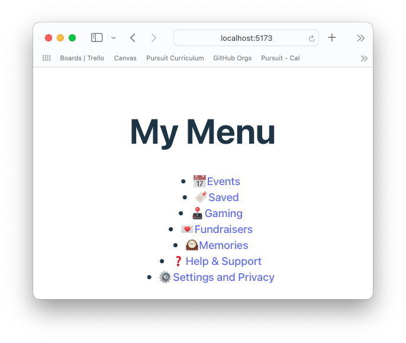
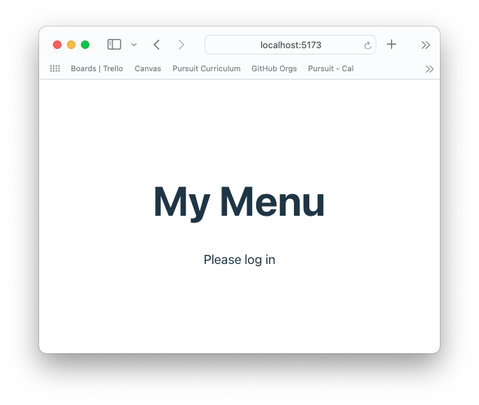

# Props and Component Structuring

## Introduction

In previous lessons, we've seen how to build React components and display them in the browser. We learned that we could reuse components. However, we could not make two different versions of the same component. Let's look again at a previous example.


Under the `Home` section, there is a list of menu items. We can imagine that each menu item is inside an unordered list (`<ul>`) and is a list element (`<li>`). Inside each list element is an icon, some text, and the text links to something else. It is likely these menu items would be their own React component. So the HTML is the same for each element. However, the content (data) is different.

You can imagine the same pattern for the `Stories`, `Posts`, and `Contacts` sections.

## Learning Objectives

- Understand what props are and what problem they solve
- Build an application that uses props
- Map over data to render it
- Conditionally render components

## Props

Props are short for the word properties. All HTML elements can have properties(referred to as `attributes` when it is plain HTML). The following anchor tag has two properties, `id` and `href`.

```HTML
<a id="best-link" href="www.example.com">My favorite website</a>
```

React extends the function of properties (props) to allow values to be passed down. This may seem strange at first. As you spend more time coding in React, you will realize the importance of this feature.

## Simple example

The following will explain how to build a simplified menu version. It will have two views, one mimicking what it would look like if a user is logged in and one if the user is not logged in. You may either read through the examples or code along by creating a new React app.





## Getting Started

Start with a new app. Replace the boilerplate code with this:

```jsx
import "./App.css";

function App() {
  return (
    <div className="App">
      <h1>Menu</h1>
    </div>
  );
}

export default App;
```

## Passing static props

The following example is a simple demonstration. Typically, you just put any text that stays the same (like the app name) as regular text. But we will set it as a variable to demonstrate the syntax and fundamentals of props.

Create a new file inside `src` called `Header.jsx`

```jsx
export default function Header() {
  return <h1>My Header</h1>;
}
```

Return to `App.jsx`, import the `Header` component, and replace the `h1` with the new component.

```jsx
import Header from "./Header";

function App() {
  return (
    <div className="App">
      <Header />
    </div>
  );
}
```

Let's set the name of the `h1` text to a variable.

```js
const headerText = "My Menu";
```

We want the `App` data to be passed to the `Header` component.

We will use the same key-value pair structure as regular HTML element properties, with several slight differences.

We can name the key whatever we want. Here we will name it `text`, but we could also name it `name`, `headerText`, or `asdf`.

```jsx
<Header text />
```

Then we set the value. The value comes from a variable and must be evaluated, so we must put curly braces around the value.

```jsx
<Header text={headerText} />
```

Go to the `Header` component. We have passed the data to this component, but how do we access it?

Let's add it as a parameter in the function definition and console log it.

```js
export default function Header(props) {
  console.log(props);
  return <h1>My Header</h1>;
}
```

To access the text, we must type `props.text`.

```js
console.log(props.text);
```

This strategy can cause a lot of typing and make reading the code harder. We can simplify this by using object destructuring.

```jsx
export default function Header({ text }) {
  return <h1>{text}</h1>;
}
```

This simple example demonstrated the basic functionality and syntax for using props. Again, there is no use case for this example, as the menu title could be hard-coded because it would not change while a user uses the app.

## Dynamic rendering from data

In contrast to the simple example of using props to set the `h1`, the better use of props is to handle more complex data.

Create a new file inside `src` called `Menu.jsx`

```js
export default function Menu() {
  return (
    <ul>
      <li>This is a list item</li>
    </ul>
  );
}
```

Import and render it in `App.jsx`

```js
import Menu from "./Menu";
import "./App.css";

function App() {
  return (
    <div className="App">
      <h1>My Menu</h1>
      <Menu />
    </div>
  );
}

export default App;
```

Create a new file `data.js` inside the `src` folder.

<details><summary>Add some data and be sure to export it</summary>

```js
const data = [
  {
    title: "Not So Secret Family Recipes",
    icon: "🥘",
    link: "#",
    custom: true,
  },
  {
    title: "Red Table Talk Group",
    icon: "🌺",
    link: "#",
    custom: true,
  },
  {
    title: "Events",
    icon: "📅",
    link: "#",
    custom: false,
  },
  {
    title: "Saved",
    icon: "🔖",
    link: "#",
    custom: false,
  },
  {
    title: "Gaming",
    icon: "🕹️",
    link: "#",
    custom: false,
  },
  {
    title: "Fundraisers",
    icon: "💌",
    link: "#",
    custom: false,
  },
  {
    title: "Memories",
    icon: "🕰️",
    link: "#",
    custom: false,
  },
  {
    title: "Help & Support",
    icon: "❓",
    link: "#",
    custom: false,
  },
  {
    title: "Settings and Privacy",
    icon: "⚙️",
    link: "#",
    custom: false,
  },
];

export default data;
```

</details>

<br>

Import and `console.log` the data in `Menu.jsx` to confirm your data is being imported correctly. Once the data is logging, remove the log to keep your console clear.

```jsx
import data from "./data";

console.log(data);
```

## Creating multiple components based on data

We want list items to be created with the same HTML structure. However, we want the content inside to be based on the data (array of objects).

How can we do this? The first thing that likely comes to mind is a loop.

```js
const listItemsWithData = [];
for (let i = 0; i < data.length; i++) {
  listItemsWithData.push(`<li>${dogs[i].name}<li>`);
}
```

However, everything inside a return statement is JSX, not JavaScript, and JSX does not allow for loops.

You do have another tool that will allow you to loop over values and return a new array: The array method `.map()`. JSX will allow you to use array methods.

First, start with a set of curly braces `{}`. The braces tell React to evaluate what is inside the curly braces first before rendering it.

```js
export default function Menu() {
  return <ul>{}</ul>;
}
```

Set up the `.map()` function to iterate over the data:

```
<ul>{data.map()}</ul>
```

Write the callback that will return a list item with the title of each menu item:

```js
{
  data.map((menuItem) => <li>{menuItem.title}</li>);
}
```

All the code together

```js
export default function Menu() {
  return (
    <ul>
      {data.map((menuItem) => (
        <li>{menuItem.title}</li>
      ))}
    </ul>
  );
}
```

## Passing props that are objects

We want the list items to have an icon, a link, and a title. React lets you split up complex HTML into smaller components that are easier to maintain. Let's make menu items into their components.

### Refactor current code:

Create a new file, `menuItem.jsx` in the src folder. We will include some placeholder text before trying to add the data.

```js
export default function MenuItem() {
  return (
    <li>
      <span>ICON</span>
      <a href="LINK">TITLE</a>
    </li>
  );
}
```

Import it into `Menu`.

Complete Menu code:

```js
import data from "./data";
import MenuItem from "./MenuItem";

export default function Menu() {
  return (
    <ul>
      {data.map((menuItem) => (
        <MenuItem />
      ))}
    </ul>
  );
}
```

> **Note**: Sometimes, code will get worse/less functional before it gets better when you are refactoring. When refactoring, it is essential to take small testable steps.

### Pass props

We want the data in the `Menu` component to be passed to the `MenuItem` component.

```jsx
<MenuItem menuItem={menuItem} />
```

## Unique key warning

When we do this, we will see an error in the console.

```
Warning: Each child in a list should have a unique "key" prop.
```

Your app will still work when there is a warning. However, it would be best to solve as many warnings as you can as you build your app, as warnings may lead to unpredictable app behavior.

In this case, React wants a unique identifier for each list item so that its algorithm for fast rendering works as expected.

Typically, when you work with actual data, the data will have a unique id. In this case, we have a simple data set and don't have an id available. We can now use the menu titles as a unique key prop, but be aware that if a menu with the same title were added, this strategy would not work.

```jsx
<MenuItem menuItem={menuItem} key={menuItem.title} />
```

## Using props

Go to the `MenuItem` component. We have passed the data to this component, but how do we access it?

Let's add it as a parameter in the function definition and console log it.

```js
export default function MenuItem({ menuItem }) {
  console.log(menuItem);
  return (
    <li>
      <span>ICON</span>
      <a href="">TITLE</a>
    </li>
  );
}
```

To access the data, we need to type `menuItem.title`, `menuItem.link`, and `menuItem.icon` to access the data.

We can use object destructuring to make the code more readable.

```js
export default function MenuItem({ menuItem }) {
  const { title, icon, link } = menuItem;
  return (
    <li>
      <span>{icon}</span>
      <a href={link}>{title}</a>
    </li>
  );
}
```

## Conditional Rendering

There are times when we might not want to show all the data.

We will use null if we don't want to show any component.

`if` statements are also not going to work in JSX. Instead, ternary operators are used.

Ternary operators are a different syntax for if statements.

The following if statement can be rewritten:

```
if (!menuItem.custom) {
return <li>{menuItem}</li>;
} else {
return null;
}
```

to

```
return menuItem.custom ? <li>{menuItem}</li> : null;
```

When you see a ternary operator, try reading out loud like so:

If NOT `menuItem.custom` is `true`, then return the first value after the question mark. `else` return the value after the colon.

Let's use it in our code.

```js
<ul>
  {data.map((menuItem) => {
    return !menuItem.custom ? (
      <MenuItem menuItem={menuItem} key={menuItem.title} />
    ) : null;
  })}
</ul>
```

You can also set conditional rendering to display different components.

Imagine if the user is not logged in. Rather than showing the menu, you want to display a "please log in" message.

In `App.jsx`, set a variable for a user being logged in:

```js
const userLoggedIn = true;
```

Set up the conditional rendering.

```js
{
  userLoggedIn ? <Menu /> : <p>Please log in</p>;
}
```

In this case, the menu should stay the same.

Change `userLoggedIn` to be `false`.

Now you should see that the menu is not loaded; instead, the login message appears.

In later lessons, you'll learn how to change the values in your React app through user interaction and get data from a third-party API.
